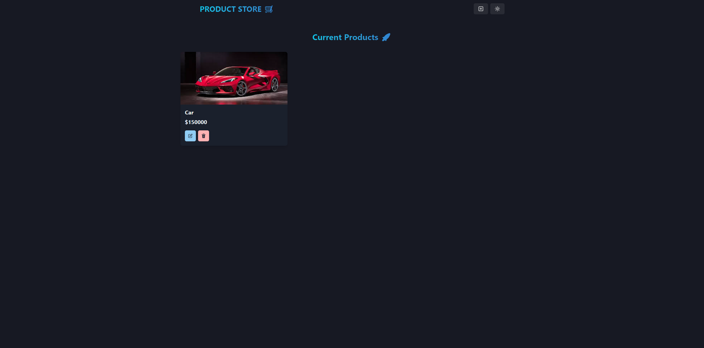

# product-store
[Link to webiste](https://product-store-kvko.onrender.com/)

## Description
This project uses the MERN stack to allow users to store products. Users are able to create products providing a name, price, and image url. Once a product is created it is added to a MongoDB <database> and displayed on the homepage. Users are also able to delete and edit products.
